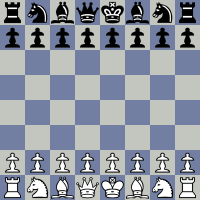

# Chessboard Image

[](https://badge.fury.io/py/chessboard-image)
[](https://www.python.org/downloads/)
[](https://opensource.org/licenses/MIT)

A pure Python library for generating beautiful chess board images from FEN notation. No external dependencies except Pillow.

## Features

✨ **Pure Python** - No browser dependencies, just PIL/Pillow  
🎨 **Multiple Themes** - Built-in professional piece sets  
🎯 **FEN Support** - Generate boards from any valid FEN notation  
📱 **Flexible Output** - Save as file, get bytes, or PIL Image object  
🔧 **Player Perspective** - View from White or Black's perspective  
📍 **Coordinates** - Optional file/rank labels  

## Installation

```bash
pip install chessboard-image
```

## Quick Start

```python
import chessboard_image as cbi

# Generate starting position
start_fen = "rnbqkbnr/pppppppp/8/8/8/8/PPPPPPPP/RNBQKBNR w KQkq - 0 1"
cbi.generate_image(start_fen, "board.png", size=400)
```


## Basic Usage

```python
import chessboard_image as cbi

# Basic generation
cbi.generate_image(fen, "board.png", size=400)

# With coordinates
cbi.generate_image(fen, "board.png", show_coordinates=True)

# Black's perspective
cbi.generate_image(fen, "board.png", player_pov="black")

# Different theme
cbi.generate_image(fen, "board.png", theme_name="alpha")

# Get as PIL Image or bytes
pil_image = cbi.generate_pil(fen, size=500)
image_bytes = cbi.generate_bytes(fen)
```

| White Perspective | Black Perspective |
|:---:|:---:|
|  |  |

| Without Coordinates | With Coordinates |
|:---:|:---:|
|  |  |

## Themes

Built-in themes: `alpha`, `wikipedia`, `uscf`, `wisteria`, `sakura`, `maestro`

| Wikipedia | Alpha | USCF |
|:---:|:---:|:---:|
|  |  |  |

| Wisteria | Sakura | Maestro |
|:---:|:---:|:---:|
|  |  |  |

```python
# List available themes
themes = cbi.list_themes()

# Use different theme
cbi.generate_image(fen, "board.png", theme_name="alpha")
```

## CLI Usage

```bash
# Basic generation
chessboard-image generate "fen_string" -o board.png

# With options
chessboard-image generate "fen_string" -o board.png -s 600 -t alpha -p black -c

# Options:
# -s, --size: Board size in pixels
# -t, --theme: Theme name  
# -p, --player-pov: white or black perspective
# -c, --coordinates: Show coordinates
```

## Examples

### Famous Positions

```python
import chessboard_image as cbi

# Scholar's Mate
scholars_mate = "r1bqkb1r/pppp1Qpp/2n2n2/4p3/2B1P3/8/PPPP1PPP/RNB1K1NR b KQkq - 0 1"
cbi.generate_image(scholars_mate, "scholars_mate.png", size=500)

# Endgame
endgame = "8/1p1b4/p7/3ppk2/6p1/2P4p/PP3B1K/5B2 b - - 0 1"
cbi.generate_image(endgame, "endgame.png", player_pov="black", show_coordinates=True)

# Sicilian Defense
sicilian = "rnbqkbnr/pp1ppppp/8/2p5/4P3/8/PPPP1PPP/RNBQKBNR w KQkq c6 0 2"
cbi.generate_image(sicilian, "sicilian.png", theme_name="alpha")
```

| Scholar's Mate | Endgame (Black POV) | Sicilian Defense |
|:---:|:---:|:---:|
|  |  |  |

### Batch Processing

```python
positions = [
    ("start", "rnbqkbnr/pppppppp/8/8/8/8/PPPPPPPP/RNBQKBNR w KQkq - 0 1"),
    ("endgame", "8/1B6/8/8/8/8/1K3Qqr/7k w KQkq - 0 1"),
]

for name, fen in positions:
    cbi.generate_image(fen, f"{name}.png", size=400, show_coordinates=True)
```

## API Reference

### Core Functions

```python
generate_image(fen, output_path=None, size=400, theme_name="wikipedia", 
              player_pov="white", show_coordinates=False)
generate_bytes(fen, size=400, theme_name="wikipedia", 
              player_pov="white", show_coordinates=False)  
generate_pil(fen, size=400, theme_name="wikipedia",
            player_pov="white", show_coordinates=False)
list_themes()
```

### Parameters

- **fen** (str): FEN notation string
- **size** (int): Board size in pixels (default: 400)
- **theme_name** (str): Theme name (default: "wikipedia")  
- **player_pov** (str): "white" or "black" perspective (default: "white")
- **show_coordinates** (bool): Show file/rank labels (default: False)

## Custom Themes

Create a JSON file with base64-encoded pieces:

```json
{
  "my_theme": {
    "pieces": {
      "wK": ["data:image/png;base64,..."], "wQ": ["data:image/png;base64,..."],
      "wR": ["data:image/png;base64,..."], "wB": ["data:image/png;base64,..."], 
      "wN": ["data:image/png;base64,..."], "wP": ["data:image/png;base64,..."],
      "bK": ["data:image/png;base64,..."], "bQ": ["data:image/png;base64,..."],
      "bR": ["data:image/png;base64,..."], "bB": ["data:image/png;base64,..."],
      "bN": ["data:image/png;base64,..."], "bP": ["data:image/png;base64,..."]
    },
    "board": ["#F0D9B5", "#B58863"]
  }
}
```

Use with: `cbi.generate_image(fen, "board.png", theme_file="my_themes.json", theme_name="my_theme")`

## Contributing

Contributions are welcome! Please feel free to submit a Pull Request.

### Development Setup

```bash
git clone https://github.com/anandjoshi91/chessboard-image.git
cd chessboard-image
pip install -e .
pip install -r requirements-dev.txt
```

### Running Tests

```bash
python -m pytest tests/
```

## Requirements

- Python 3.7+
- Pillow (PIL)

## License

This project is licensed under the MIT License - see the [LICENSE](LICENSE) file for details.

## Changelog

### 1.1.4
- Fixed transparency handling for grayscale piece images (LA mode)
- Now supports RGBA, LA, PA and any image mode with alpha channel
- Fixes issue where pieces with LA mode showed black backgrounds
- Added maestro theme (6 built-in themes total)

### 1.1.3
- Initial release
- Support for FEN notation
- Built-in 5 themes [alpha, wikipedia, uscf, wisteria, sakura]
- Generate image from pov of black or white player
- Add optional file and rank coordinates